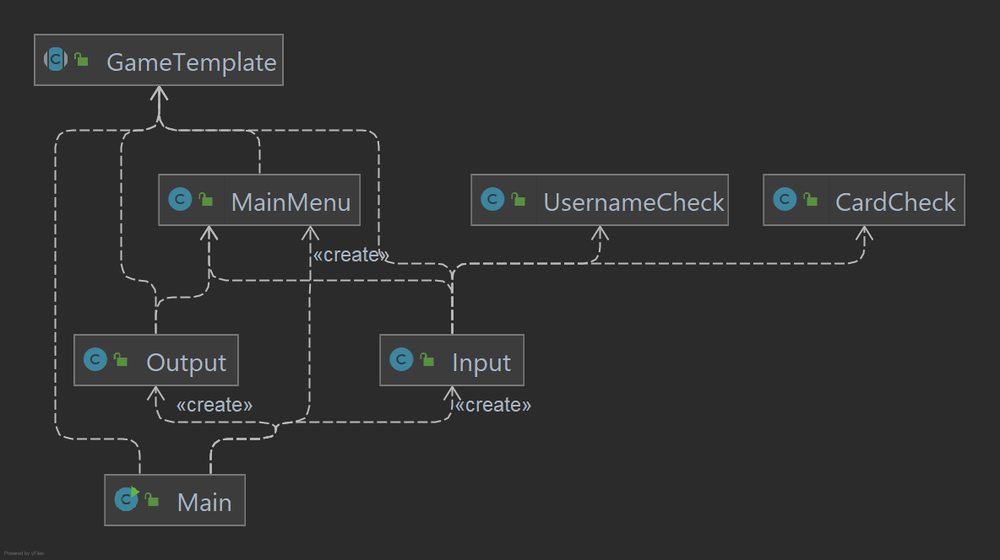
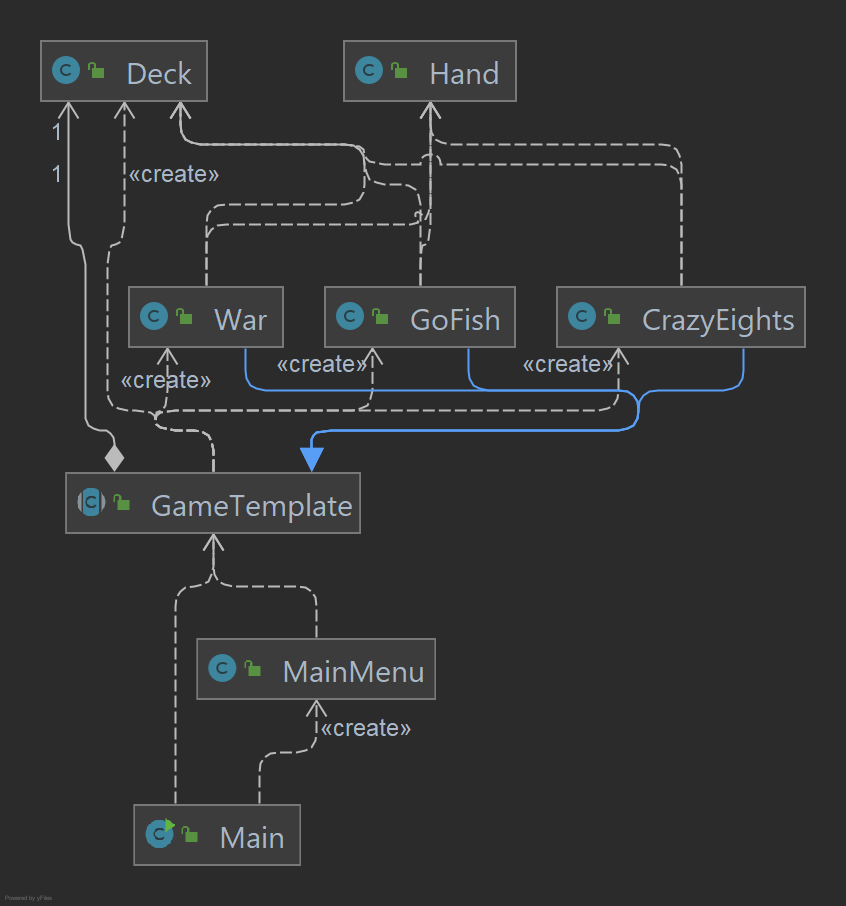
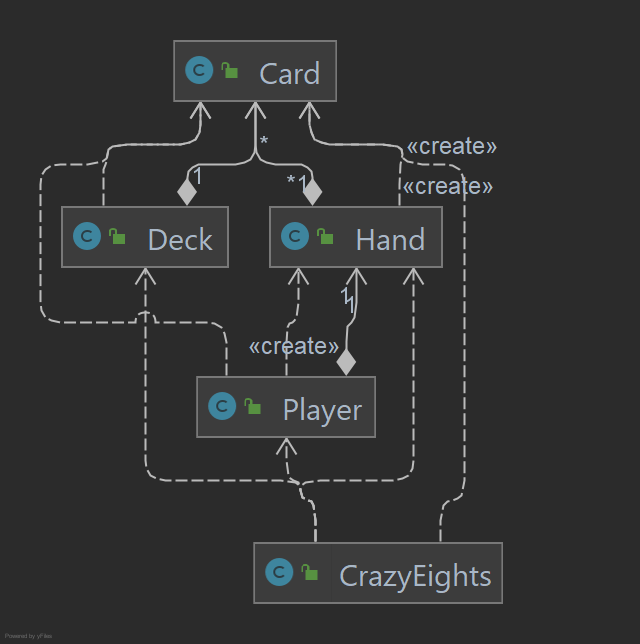
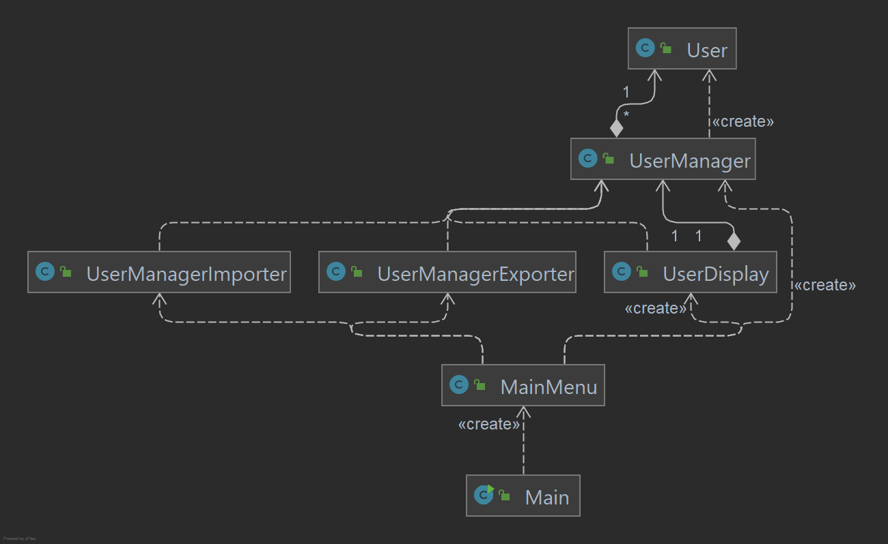

# Design Document

## Updated Specification

* The specification remains mostly the same, except for an additional game Go Fish that was added in this phase. 
* Main additions for phase 1 are:
  * Added a main menu (previously, launching the project launched straight into Crazy Eights)
  * Added "user" functionality&mdash;tracking users and their game statistics through their username
  * Added serialization of users (users' statistics are stored between program runs)
  * Added a basic GUI (only implemented in Crazy Eights for now, other games and design improvements are to be done in phase 2)
* The rules of Go Fish are as follows:

### Go Fish

* 2+ players, 52 cards
* Start:
  * any player deals one card face up to each player. The player with the lowest card is the dealer. The dealer shuffles the cards, and the player to the right cuts them
  * dealer deals cards clockwise one at a time, face down
  * for two or three people, each player receives seven cards
  * for four or five people, each player receives five cards
  * rest of cards placed face down in middle
* Play:
  * player to the left of the dealer and asks any other player for cards of a certain rank
  * if the addressed player does not have any card of the given suit, they say, "Go Fish" and the player who made the request draws the top card from the middle
  * if the player does receive one or more card of the given suit, they can ask the same or another player for a card
  * as long as the player succeeds in getting cards, their turn continues
  * if a player gets the fourth card of the same suit, the player shows all four cards and places them on the table face up
  * if a player is left without cards, the player may draw from the middle and then ask for cards of that rank
  * if there are no cards left in the middle, they are out of the game
* Win condition:
  * the game ends when all thirteen suits have been won
  * the winner is the player with the most set of cards

## Major Design Decisions
* As of right now, the implementation of the GUI doesn't perfectly follow the SOLID design principles. It violates the dependency rule since methods of the GUI are directly being called from `CrazyEights`. In Phase 2, we are planning to fix this problem either by redesigning the output interface to be less vague or to use the Façade design pattern to the fix the problem by creating a class that takes the object that is trying to be outputted and decide how to display that using the GUI. 
* The input and output interfaces are separate for the games and for the main menu. This was done to avoid forcing an implementer to implement both interfaces. It may be necessary to have a more unified input/output interface in the future, since having these multiple interfaces requires these IO objects to be passed lower than may be necessary.

## Clean Architecture

Our code can be divided into 3 systems which work together to perform the task necessary to run our system.
These 3 systems are:

1. Console IO Flow: This system is used to pass input to and from the usecases of the application and the users
2. Game Generation and Management: This system is used to create and play new games
3. User Creation and Storage: This system is used to create users to be used as players in the games, saving their stats as well

#### Console IO Flow

This system is where the main method of our application is. When `Main` is run, it uses the `console.Input` and `console.Output` classes, 
which communicate with `MainMenu`. `MainMenu` is where Games are selected and where users are verified to play in games.
If user operations are selected, MainMenu will communicate with the User Creation and Storage systems. If a game is selected,
`MainMenu` will communicate with the Game Generation and Management system.

#### Game Generation and Management

When a game is called upon by `MainMenu`, this system activates. Each game is created as a child of the abstract class `GameTemplate `
to standardize the methods which `MainMenu` has to use. The 3 games which are implemented currently are 
`CrazyEights`, `War`, and `GoFish`. These games, all use instances of our entity classes `Deck` and `Hand` to simulate the decks and
hands of players in each respective game. 

We can see a more in depth example of how games interact with the entity classes in the below image:

#### User Creation and Storage

When user operations like creating a new user or checking the stats of an existing user are selected in `MainMenu`,
this system activates. The requests from `MainMenu` are processed through the `UserManager` class, and assisted by 
`UserManagerImporter`, `UserManagerExporter`, and `UserDisplay`. These allow us to interact with and create new instances
of our custom entity class User, and use them to play games with. 

#### Violations Of Clean Architecture

As a whole, our code has few violations of clean architecture. Our biggest violation comes from the fact that because of
the implementation of our GUI, the games using it (as of now we've only implemented `CrazyEights` to work with the GUI) are
dependent on it. This violates clean architecture, as changes in the GUI system will have to be reflected in `CrazyEights`.
However, this violation is due to the fact that GUI systems have only started to be integrated. We are currently looking 
in to creating some sort of façade class to allow for communication between the systems, or possibly changing the interfaces
themselves. This issue is also touched on in the Major Design Decisions paragraph. 

The other potential violation of clean architecture present in our code is the fact that the entity classes `Deck` and `Hand`
depend on the entity class `Card`. However, we are unsure if this violates clean architecture, and if so how to remedy it. 
Since `Hand`s and `Deck`s are made up of `Card`s, it makes sense for them to be dependent, but if this is found to be against
clean architecture then other solutions will be found.

## SOLID Design Principles.

* Single Responsibility
  * The console input interface (`presenters.console.Input`) only does one thing&mdash;retrieve input from the user through the console. It retrieves input from the user, parses does very basic input validation ("10S" is a valid card string whereas "404W" is not), and then returns primitive representation of the desired input (for example the `String` "S10" to represent the 10 of spades).
* Open/Closed
  * The `GameTemplate` class defines common operations that are required between all games, such as the logic required for `User` management (adding wins, adding games played, etc.). New subclasses of `GameTemplate` will not need to change this code, but can depend on said code doing the right thing.
* Liskov's Substitution
  * All subclasses of `GameTemplate`, such as `CrazyEights`, all have common functionality like the `startGame()` entry method, or the `getMaxPlayers()` method. This means the `GameSelector` can depend on these methods existing and working correctly regardless of what subclass of `GameTemplate` is actually being used.
* Interface Segregation
  * Rather than have one main input/output interface for both the `GameSelector` and each individual game, interfaces were separated allowing implementations to choose which interfaces to implement.
* Dependency Inversion
  * Each game (subclasses of `GameTemplate`) must depend on an interface between the game and the user running the code. An interface was used to specify the ways a user could interact with the game, and the subclasses of `GameTemplate` only depended on there being given some implementation of the interface, but did not directly depend on the implementation.

## Packaging Strategy

We primarily considered the packaging by component and the packaging by layer strategies. We decided on the packaging by layer strategy to make our layers more clear and make it easy to tell whether the dependency rule is violated. However, as our project expands in scope, it might be worth reconsidering our use of packaging by layer since each of the packages have low cohesion.

## Design Patterns

* Factory Method
  * `GameTemplate.gameFactory()` is used to create the various games. When games are added/removed from the pool of available games, `GameTemplate` must be changed, but not the menu implementation in `GameSelector`. `GameSelector` remains independent of the actual available games.
* Dependency Inversion
  * `GameTemplate` and `GameSelector` define input and output interfaces. These classes have parameters in their constructors for implementations of these interfaces. This allows classes in the layers above them to choose which implementation they wish to use. Additionally, having these interfaces defined means testing is much easier. For example, in `GoFishTest`, a class that emulates the behaviour of a user is used to test the `GoFish` game functionality.

## Progress Report

### Open questions

1. How can we redesign our output interface to handle the various messages/types of actions that need to be triggered in the GUI?
2. Would migrating to a database be worth it for our project? It would allow for flexibility in the future should we decide to do more with the users and their statistics, but it would be more complex than the current solution.
3. Would abstracting away some sort of "menu" superclass make sense for our current design? We decided against it for phase 1 because there's only one main menu, and we thought abstracting it away would just add unnecessary complexity. Would abstracting it work/make sense with our GUI?

### What has worked well

* Using issues/milestones on GitHub has been a very effective tool to both assign work to people without having to have a general meeting all the time and to ensure that everyone is aware of what work needs to be done and where.
### What each group member has been working on

* Raymond: Added the `GameSelector` menu (and related console IO), added `UserManager` serialization flows, worked on general improvements across the project, coordinated GitHub activities, worked on the design document.
* Teddy: Added `User` entity class and `UserManager` usecase; integrated user functionality across the entire project; worked on `GameSelector` menu; cleaned up and added functionality to `CrazyEights`.
* Brian: Added `User` entity class and `UserManager` usecase with Teddy; integrated user functionality; created a stat display menu in the main menu; integrated basic GUI with `CrazyEights`.
* Bradley: Worked with Daniel on implementing the `War` usecase. Reviewed pull requests. Worked on the Design Document.
* Daniel: Worked alongside Bradley on implementing the `War` usecase. Addressed issues with entity classes and streamlined `Hand` to implement the `Iterable` interface. 
* Azamat: Implemented the `GoFish` game as a subclass of `GameTemplate`. Extended other classes (`Card`, `Hand`, `Player`, and `Input`) by adding new/overloading existing methods to assist with `GoFish`'s functionality. Tested `GoFish` by first predefining a sequence of user inputs such that the game successfully ends, and then asserting that a set of post-game conditions hold.
* Luke: Added `PlayerGUI` and `SingleCardGUI` classes. Created and designed the GUI as well as wrote tests for other code. Reviewed pull requests and other GitHub maintenance.
* Nitish: Changed the implementation for `Deck` by changing it from a list to queue for more efficiency and helped with testing `GoFish`.

### What each group member plans to work on next
* Raymond: Migrating serialization to a database, continue improving design and efficiency across the project.
* Teddy: Improve user functionality, add more features or work on a new game
* Brian: Integrate other games with the GUI, improve GUI interactions with each game
* Bradley: Progress the GUI to account for all the games implemented. May work on a new game. 
* Daniel: Work alongside Luke and Bradley to progress the GUI. May work on a new game. 
* Azamat: Implement a new card game. Refactor code in `GameTemplate` and its subclasses to pull common operations in subclasses out to `GameTemplate` (base class).
* Luke: Continue to expand upon GUI. Clean up current GUI implementation, most likely refactoring to utilise polymorphism effectively. Redesign Input and Output interfaces to be specific to the project.
* Nitish: Continue to fix bugs, refactor code, and may work on a new game.

