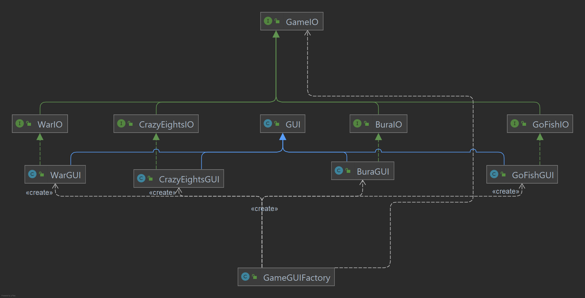
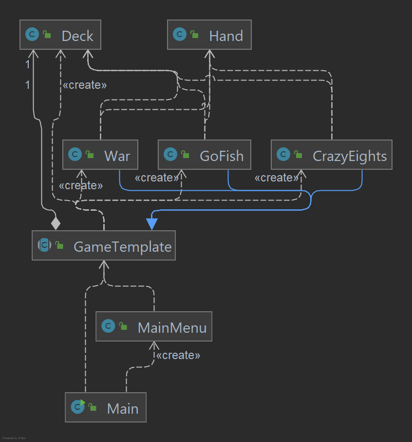
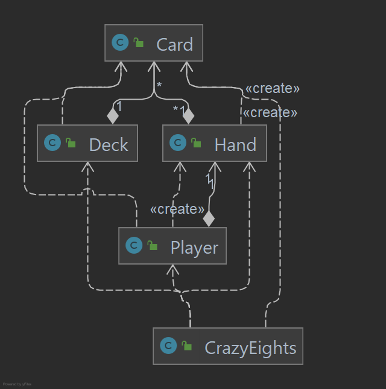
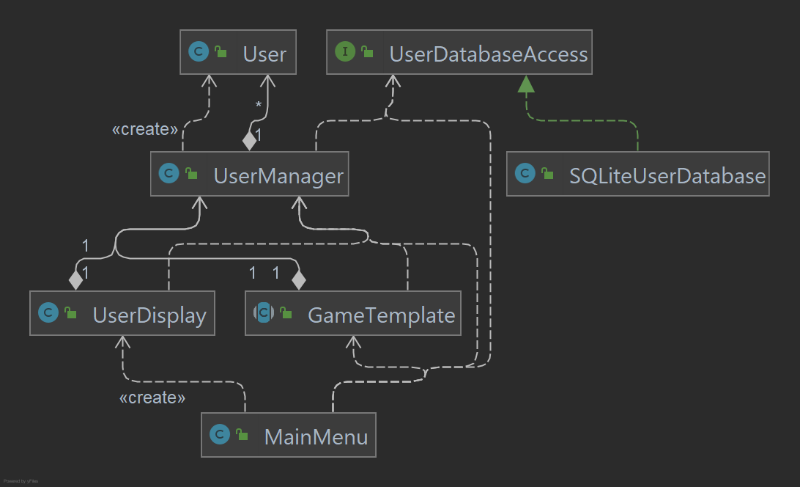

# Design Document

## Specification

* Main idea: collection of various card games in a *pass-and-play* type format
* When running: 
  * A GUI will be used to interact with the program allowing players to click on menu items, select cards, etc.
  * The main menu should allow users to select which game they wish to play, and check on their game statistics
  * During gameplay, users should be able to 
    * See their own cards
    * See the state of the table (e.g. the user should see which cards are on the stack in Crazy Eights)
    * Play cards from their hand
    * Get feedback if an invalid card has been played (e.g. in Crazy Eights, the played card must match the top card on the stack's rank or suit)
  * At the end of a game, an appropriate end-game screen should be shown, with options allowing the user to play the same game again or return to the main menu
  * Users will get the opportunity to select a username as a way to track their own statistics
    * Statistics that should be tracked are: games played, games won, games tied
	* These user profiles will persist between application runs
* Supported games (rules in section below)
  * Crazy Eights
  * War
  * Go Fish
  * Bura

### Game Rules

(Sourced from [Bicycle Cards](https://bicyclecards.com/rules/) and [Pagat.com](https://www.pagat.com/aceten/bura.html) with minor modifications)

#### Crazy Eights

* 2+ players, 52 cards
* Start:
  * Deal 5 cards to each player
  * Rest of cards placed face down in middle (deck)
  * Top most card on deck is flipped to form a starter pile
* Play:
  * Each player take turns placing cards from their hand into the starter pile
    * Cards must match suit or number (exception: 8s)
      * 8s can be played on at any time in turn, on play, player must specify suit (but not a rank)
      * The next player must follow the specified suit (or play an 8)
    * If no valid cards to play: draw one card from deck 
    * If the deck is empty, the current player must pass their turn
    * Even if there's a valid move, player can still draw from deck
* Win condition:
  * Player with no cards left wins

#### War

* 2 players, 52 cards
* Start: 
  * Deal half deck to each player
* Play:
  * Each player puts down top card of their stack (players cannot choose the card to put down)
  * Compare cards, player with higher card takes both cards into bottom of their stack
  * If they're the same, 
    * Take top two cards from own stack (one face up, one face down)
    * Compare face up card, player with higher one takes all cards in play
    * If tie, take another card, place face down
    * Flip over original face down and compare
    * Continue until one person has a higher card
* Win condition: 
  * Player who has all the cards

#### Go Fish

* 2+ players, 52 cards
* Start:
  * any player deals one card face up to each player. The player with the lowest card is the dealer. The dealer shuffles the cards, and the player to the right cuts them
  * dealer deals cards clockwise one at a time, face down
  * for two or three people, each player receives seven cards
  * for four or five people, each player receives five cards
  * rest of cards placed face down in middle
* Play:
  * player to the left of the dealer and asks any other player for cards of a certain rank
  * if the addressed player does not have any card of the given suit, they say, "Go Fish" and the player who made the request draws the top card from the middle
  * if the player does receive one or more card of the given suit, they can ask the same or another player for a card
  * as long as the player succeeds in getting cards, their turn continues
  * if a player gets the fourth card of the same suit, the player shows all four cards and places them on the table face up
  * if a player is left without cards, the player may draw from the middle and then ask for cards of that rank
  * if there are no cards left in the middle, they are out of the game
* Win condition:
  * the game ends when all thirteen suits have been won
  * the winner is the player with the most set of cards

#### Bura

* 2+ players, 36 card (4 suits; ranks A, 6-K)
* Start:
  * (Modified) Cards are dealt out singly until each player has one card
    * each player is dealt 3 cards each originally
  * Next card in the deck is turned face up to show the trump suit and the rest is placed face down in the middle
* Play:
  * Player to the left of the dealer leads the first trick
  * (Modified) Player may choose a card in their hand to play
    * originally given a choice to play 1, 2, or 3 cards of the same suit
  * The next player can play any card they wish - no requirement to follow suit or rank
  * The goal of each player is to then beat the card that was previously of the highest "value"
  * A card can be beaten by a higher card of the same suit, and any non-trump card can be beaten by any trump
  * Player that played the card of the highest "value" wins the trick
  * The winning player of the trick takes all the cards that were played in the trick
  * After the trick ends, one card is dealt to each player from the deck, and the next trick starts
* Win condition:
  * (Modified) the game ends when a player reaches 31 points
    * each card is given a points-value
      * Ace: 11pts, Ten: 10pts, King: 4pts, Queen: 3pts, Jack: 2pts, 9-6: 0 pts
    * originally a player is allowed to "call the game" by claiming that they have 31 points. If the player does have 31 points, the player wins. If the player does not have 31 points, the game ends with that player losing.
  * if the deck is exhausted before a player reaches 31 points, the player with the highest point wins 
 

  

## Clean Architecture

Our code can be divided into 3 systems which work together to perform the task necessary to run our system.
These 3 systems are:

1. GUI Flow
2. Game Generation and Management: This system is used to create and play new games
3. User Creation and Storage: This system is used to create users to be used as players in the games, saving their stats as well

#### GUI IO Flow

In order to adhere to the SOLID principles, especially dependency inversion, we created the following system for
creating the GUI. First, each game specifies an IO interface following the naming convention of `$GAMENAME$IO` so for
example, the game of Crazy Eights specifies an interface called `CrazyEightsIO`. By doing this, we are able to decouple
the games from the finer details of how the game will interact with the user, thus following clean architecture as well
as the SOLID principles. Each of these interfaces extends a master interface called `GameIO`.

These interfaces are implemented by the subclasses of a class called GUI, which includes a lot of boilerplate code that
is needed to get the graphics working in the first place. Implementations for the previously discussed interfaces follow
the naming convention of `$GAMENAME$GUI`, e.g. the GUI implementation for Crazy Eights is called `CrazyEightsGUI`.

Finally, we use a factory method to create the proper objects and pass them to the game. As can be seen in this UML
Diagram:

This is easily expandable. The group designing the new game would first specify an interface for their new game,
including all the ways they would need the user to interact with their game. Then while the game code itself is being
written, another group responsible for the GUI would implement the interface by creating another subclass of the GUI
parent class.

#### Game Generation and Management

When a game is called upon by `MainMenu`, this system activates. Each game is created as a child of the abstract class `GameTemplate `
to standardize the methods which `MainMenu` has to use. The 3 games which are implemented currently are 
`CrazyEights`, `War`, and `GoFish`. These games, all use instances of our entity classes `Deck` and `Hand` to simulate the decks and
hands of players in each respective game. 

We can see a more in depth example of how games interact with the entity classes in the below image:

#### User Creation and Storage

When user operations like creating a new user or checking the stats of an existing user are selected in `MainMenu`,
this system activates. The requests from `MainMenu` and `UserDisplay` are processed through the `UserManager` class, allowing users to be added and 
user statistics to be retrieved/modified. These allow us to interact with and create new instances
of our custom entity class `User`, and use them to play games with. 

Serialization of users is done through the `UserDatabaseAccess` interface. This interface defines methods and exceptions used to communicate with any 
type of user database gateway. Currently, an SQLite database is used to serialize user data, but having a `UserDatabaseAccess` interface allows
database implementations to be swapped at will in the main method. One example of this is in the test classes for 
[`UserManager`](https://github.com/CSC207-UofT/course-project-the-losers-club/blob/main/src/test/java/usecases/UserManagerTest.java). A fake database is used
to simulate the storage of user information for the purposes of testing.

#### Violations Of Clean Architecture

Compared to Phase 1, we've resolved our violations of clean architecture by carefully designing our GUI implementations and boundary crosses. Previously, `CrazyEights` directly depended on a GUI implementation, but that has since been refactored to our `GameIO` interface structure described above.

Due to the refactoring and other code improvements done between phase 1 and phase 2, we feel as though there are no major violations of clean architecture. 

## Major Design Decisions

* The largest design decision we faced in phase 2 was overhauling the GUI we had created in phase 1. The GUI created for
  phase 1 had several problems and as such we scrapped what we had and started fresh. We considered several solutions to
  our GUI problems, such as implementing use of the facade design pattern to create a class as a go between for the games
  and the GUI so that the GUI would know what kind of output to do for each game, but we eventually settled on the
  system that was described in the GUI IO Flow section. We choose this setup because we felt it best followed the SOLID
  principles, in particular Dependency Inversion, Single Responsibility Principle, and Interface Segregation Principle.   
  For details of how those SOLID principles where taken into consideration, see the section on the SOLID Principles in
  this design document.

## SOLID Design Principles

* Single Responsibility
  * The `SQLiteUserDatabase` only does one thing&mdash;connect with an SQLite database and query it. All database queries go through this class, and is the only class in our program that contains SQL. The users of this class do not need to know how the SQLite connection works, but can simply call methods to gather the required information.
  * Each GUI implementation is specific to the game it is creating a GUI for. 
* Open/Closed
  * The `GameTemplate` class defines common operations that are required between all games, such as the logic required for `User` management (adding wins, adding games played, etc.). New subclasses of `GameTemplate` will not need to change this code, but can depend on said code doing the right thing.
* Liskov's Substitution
  * All subclasses of `GameTemplate`, such as `CrazyEights`, all have common functionality like the `startGame()` entry method, or the `getMaxPlayers()` method. This means the `MainMenu` can depend on these methods existing and working correctly regardless of what subclass of `GameTemplate` is actually being used. In other words, substituting subclasses of `GameTemplate` does not change the behaviour of the game creation and run flow. 
  * This also means that extending our program with new games is simple. By subclassing `GameTemplate` and adding it to the game creation factory, new games can be added with no changes to `MainMenu`.
* Interface Segregation
  * Each game defines its own extension of the `GameIO` interface, and defines what input and output methods it requires. Then, the actual GUI implementation must implement this interface to support the game. Separating these interfaces means individual GUI implementations do not need to support methods and actions that are not needed by the actual game.
  * Each game defines its own `$GAMENAME$IO` so that the methods can be specific to the game and it doesn't need to try
    and figure out the details of how that interface will fit and work around the other games IO.
* Dependency Inversion
  * `UserManager` depends on connecting to a database to serialize users. To avoid a dependency rule violation, the interface `UserDatabaseAccess` is defined. Then, `SQLiteUserDatabase` simply implements this interface. To then inject the depenency, an instance of `SQLiteUserDatabase` is instantiated in `Main` and passed into the `UserManager` to store. Defining an interface this way also allows different implementations of databases to be used; it would be very easy to switch to another relational databases like MySQL.
  * Each game depends only on the IO interface that is specifies rather any ony particular implementation of the required IO.

## Packaging Strategy

We primarily considered the packaging by component and the packaging by layer strategies. We decided on the packaging by layer strategy to make our layers more clear and make it easy to tell whether the dependency rule is violated. However, since our project has expanded in scope, we've begun introducing subpackages to further divide our code. For example, a `usecases.usermanagement` subpackage is used for the user related classes.

## Design Patterns

* Factory Method
  * `GameTemplate.gameFactory()` is used to create the various games. When games are added/removed from the pool of available games, `GameTemplate` must be changed, but not the menu implementation in `MainMenu`. This means `MainMenu` remains independent of the actual available games.
* Dependency Inversion
  * As described above, the games define input and output interfaces. This allows classes in the layers above them to choose which implementation they wish to use through dependency injection. Additionally, having these interfaces defined means testing is much easier. For example, in `GoFishTest`, a class that emulates the behaviour of a user by implementing `GoFishIO` is used to test the `GoFish` game functionality.

## Progress Report

### Work Since Phase 1

* Raymond: Migrated serialization of `User`s from Java's object input/output streams to a SQLite database, assisted with GUI implementation, improved design document, coordinated GitHub activities.
* Teddy: Created IO interfaces for each of the games and helped connect each game to the GUI
* Brian: Created the new Bura game
* Bradley: Worked on creating the War IO interface with Daniel and connected War with the GUI alongside Teddy. Reviewed PRs and added javadocs to all the classes. Improved design document.
* Daniel: Worked alongside Bradley and Teddy to create the `WarIO` interface and connect War to `WarGUI`. Wrote tests for `Card`, `Hand`, and `Player` classes. 
* Azamat: 
* Luke: Designed the GUI IO flow for the project as well as implemented all IO interfaces with GUI's.
* Nitish: 

### Significant PRs

* Raymond: 
  * [Added the `MainMenu` controller](https://github.com/CSC207-UofT/course-project-the-losers-club/pull/52)
    * This PR defined the controller layer allowing us to switch between games and handle user serialization. It moved our project away from a single game into a more developed collection of games.
  * [Migrated `User` serialization to SQLite](https://github.com/CSC207-UofT/course-project-the-losers-club/pull/101)
    * This PR included a more clean implementation of user serialization which defines interfaces and allows for future expansion. This new design allows different SQL databases to be used, which consequently allows for different statistics to be tracked through a more sophisticated database structure.
* Teddy: 
  * [Connected all games to the GUI](https://github.com/CSC207-UofT/course-project-the-losers-club/pull/126)
    * This was a significant contribution because without this the game logic would not connect to the GUI
  * Created [Crazy IO](https://github.com/CSC207-UofT/course-project-the-losers-club/pull/109), [GoFish IO](https://github.com/CSC207-UofT/course-project-the-losers-club/pull/113), [Bura IO](https://github.com/CSC207-UofT/course-project-the-losers-club/pull/115/files)
    * Without these IO's we would violate Clean Architecture and dependency rules and would not be able to connect the games to the GUI
* Brian: 
  * [Added `Bura` Game](https://github.com/CSC207-UofT/course-project-the-losers-club/pull/107)
    * This PR added a new game to the already existing collection of games. This new game extended the scope of the project, making it better fit the requirements of Phase 2
* Bradley: 
  * [Created War](https://github.com/CSC207-UofT/course-project-the-losers-club/pull/75)
    * This PR was where one of the 4 games, War, was created.
  * [Created `WarIO`](https://github.com/CSC207-UofT/course-project-the-losers-club/pull/122)
      * Worked alongside Daniel and Teddy to creat this file through a discord call. Critical in making sure there were nodependency violations in our code and was able to work with the GUI
* Daniel: 
    * [Created `WarIO`](https://github.com/CSC207-UofT/course-project-the-losers-club/pull/122)
        * Without this IO we would have violated Clean Architecture and depedency rules and would not have been able to connect War to the GUI.
    * [Helped create `War` and tests for `War`](https://github.com/CSC207-UofT/course-project-the-losers-club/pull/75)
        * This PR allows the program to play the game War, one of the four playable games that make up the project.  
* Azamat: 
* Luke: 
  * [Implemented CrazyEightsIO with CrazyEightsGUI](https://github.com/CSC207-UofT/course-project-the-losers-club/pull/112)
    * This created the GUI CrazyEights uses in the finished product
  * [Implemented BuraIO with BuraGUI](https://github.com/CSC207-UofT/course-project-the-losers-club/pull/125)
    * This created the GUI Bura uses in the finished product
  * [Created Master GUI Class](https://github.com/CSC207-UofT/course-project-the-losers-club/pull/111)
    * Added the parent class from which all GUI's took functionality from.
* Nitish:
  * [Helped create `Bura`](https://github.com/CSC207-UofT/course-project-the-losers-club/pull/107)
    * Worked alongside Azamat and Brian to create the game Bura using Code with Me while working together in person allowing us to work on it collaboratively at the same time.

## Accessibility Report

### Principles of Universal Design

For each Principle of Universal Design, write 2-5 sentences or point form notes explaining which features your program adhere to that principle. If you do not have any such features you can either: (a) describe features that you could implement in the future that would adhere to principle or (b) explain why the principle does not apply to a program like yours.

1. Equitable Use
   * Our program is not designed to accommodate anyone with visual impairments. We could have added a text-to-speech functionality to accommodate those people.
   * There is no significant concern for privacy in our program as users are not asked to store any sensitive information
2. Flexibility in Use
   * Our program allows for both right-handed and left-handed individuals as they are only required to make clicks
   * However, user(s) are not able to customize any part of the program to suit their preferences. We could have added functionality to allow the user to change card face designs, change between light and dark themes, change fonts, etc.
3. Simple and Intuitive Use
   * GUI implementation of all games is very straight-forward and easy to follow for the user. There are no unnecessary or distracting buttons or backgrounds.
   * Feedback is prompted to the user whenever an invalid card is chosen, a player wins the game, a player's turn is changed.
   * All text used is extremely simple and easy to understand without much concentration needed.
4. Perceptible Information 
   * GUI implementation provides adequate contrast between the background, text, and buttons providing an easy to look at program.
   * Instructions and important information is provided by popups which makes it easy to deliver information to the user.
   * We did not have time to implement a GUI that is accommodating to those that are colour-blind. However, we could have added an option in the main menu to change the colours of the cards to accommodate those people.
5. Tolerance for Error
   * Whenever a player selects an invalid card or performs an action that is invalid, a message is sent to the user to try again.
6. Low Physical Effort
   * Each game requires very little effort to play, requiring user's to read simple instructions and click a few buttons.
   * There are some repetitive actions as games occasionally take a long time to finish, so if we had more time we could have implemented a fast-forward action.
7. Size and Space for Approach and Use
   * Using our program requires local interaction with a computer which allows for a clean light of sight to those that are standing or seated and additionally allows for space for a user, as they can set up the computer however they wish.
   * By the same reasoning, the user(s) have the flexibility to allow themselves to have enough room to reach their computer

### Target Audience

This program is truly marketable to all audiences. Any individual that enjoys card games is a potential target audience. From students that want a break from studying to a family looking for some family-friendly fun, anyone can use our program and use it to its full extent. 

### Demographics

Although our program has the potential to be used by all demographics, this program will most likely attract a younger audience. Card games tend to be more popular among children and teens. Regardless, we believe there will a fair amount of adults and elderly enjoying our program, albeit at a lesser degree.
