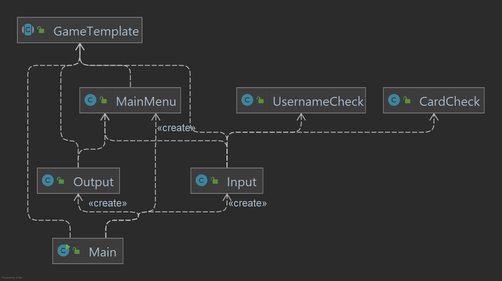

# Design Document

## Specification

* Main idea: collection of various card games in a *pass-and-play* type format
* When running: 
  * A GUI will be used to interact with the program allowing players to click on menu items, select cards, etc.
  * The main menu should allow users to select which game they wish to play, and check on their game statistics
  * During gameplay, users should be able to 
    * See their own cards
    * See the state of the table (e.g. the user should see which cards are on the stack in Crazy Eights)
    * Play cards from their hand
    * Get feedback if an invalid card has been played (e.g. in Crazy Eights, the played card must match the top card on the stack's rank or suit)
  * At the end of a game, an appropriate end-game screen should be shown, with options allowing the user to play the same game again or return to the main menu
  * Users will get the opportunity to select a username as a way to track their own statistics
    * Statistics that should be tracked are: games played, games won, games tied
	* These user profiles will persist between application runs
* Supported games (rules in section below)
  * Crazy Eights
  * War
  * Go Fish
  * Bura

## Game Rules

(Sourced from [Bicycle Cards](https://bicyclecards.com/rules/) with minor modifications)

### Crazy Eights

* 2+ players, 52 cards
* Start:
  * Deal 5 cards to each player
  * Rest of cards placed face down in middle (deck)
  * Top most card on deck is flipped to form a starter pile
* Play:
  * Each player take turns placing cards from their hand into the starter pile
    * Cards must match suit or number (exception: 8s)
      * 8s can be played on at any time in turn, on play, player must specify suit (but not a rank)
      * The next player must follow the specified suit (or play an 8)
    * If no valid cards to play: draw one card from deck 
    * If the deck is empty, the current player must pass their turn
    * Even if there's a valid move, player can still draw from deck
* Win condition:
  * Player with no cards left wins

### War

* 2 players, 52 cards
* Start: 
  * Deal half deck to each player
* Play:
  * Each player puts down top card of their stack (players cannot choose the card to put down)
  * Compare cards, player with higher card takes both cards into bottom of their stack
  * If they're the same, 
    * Take top two cards from own stack (one face up, one face down)
    * Compare face up card, player with higher one takes all cards in play
    * If tie, take another card, place face down
    * Flip over original face down and compare
    * Continue until one person has a higher card
* Win condition: 
  * Player who has all the cards

### Go Fish

* 2+ players, 52 cards
* Start:
  * any player deals one card face up to each player. The player with the lowest card is the dealer. The dealer shuffles the cards, and the player to the right cuts them
  * dealer deals cards clockwise one at a time, face down
  * for two or three people, each player receives seven cards
  * for four or five people, each player receives five cards
  * rest of cards placed face down in middle
* Play:
  * player to the left of the dealer and asks any other player for cards of a certain rank
  * if the addressed player does not have any card of the given suit, they say, "Go Fish" and the player who made the request draws the top card from the middle
  * if the player does receive one or more card of the given suit, they can ask the same or another player for a card
  * as long as the player succeeds in getting cards, their turn continues
  * if a player gets the fourth card of the same suit, the player shows all four cards and places them on the table face up
  * if a player is left without cards, the player may draw from the middle and then ask for cards of that rank
  * if there are no cards left in the middle, they are out of the game
* Win condition:
  * the game ends when all thirteen suits have been won
  * the winner is the player with the most set of cards

## Major Design Decisions

* As of right now, the implementation of the GUI doesn't perfectly follow the SOLID design principles. It violates the dependency rule since methods of the GUI are directly being called from `CrazyEights`. In Phase 2, we are planning to fix this problem either by redesigning the output interface to be less vague or to use the Façade design pattern to the fix the problem by creating a class that takes the object that is trying to be outputted and decide how to display that using the GUI. 
* The input and output interfaces are separate for the games and for the main menu. This was done to avoid forcing an implementer to implement both interfaces. It may be necessary to have a more unified input/output interface in the future, since having these multiple interfaces requires these IO objects to be passed lower than may be necessary.

## Clean Architecture

Our code can be divided into 3 systems which work together to perform the task necessary to run our system.
These 3 systems are:

1. Console IO Flow: This system is used to pass input to and from the usecases of the application and the users
2. Game Generation and Management: This system is used to create and play new games
3. User Creation and Storage: This system is used to create users to be used as players in the games, saving their stats as well

#### Console IO Flow

This system is where the main method of our application is. When `Main` is run, it uses the `console.Input` and `console.Output` classes, 
which communicate with `MainMenu`. `MainMenu` is where Games are selected and where users are verified to play in games.
If user operations are selected, MainMenu will communicate with the User Creation and Storage systems. If a game is selected,
`MainMenu` will communicate with the Game Generation and Management system.

#### Game Generation and Management

When a game is called upon by `MainMenu`, this system activates. Each game is created as a child of the abstract class `GameTemplate `
to standardize the methods which `MainMenu` has to use. The 3 games which are implemented currently are 
`CrazyEights`, `War`, and `GoFish`. These games, all use instances of our entity classes `Deck` and `Hand` to simulate the decks and
hands of players in each respective game. 

We can see a more in depth example of how games interact with the entity classes in the below image:

#### User Creation and Storage

When user operations like creating a new user or checking the stats of an existing user are selected in `MainMenu`,
this system activates. The requests from `MainMenu` and `UserDisplay` are processed through the `UserManager` class, allowing users to be added and 
user statistics to be retrieved/modified. These allow us to interact with and create new instances
of our custom entity class `User`, and use them to play games with. 

Serialization of users are done through the `UserDatabaseAccess` interface. This interface defines methods and exceptions used to communicate with any 
type of user database gateway. Currently, an SQLite database is used to serialize user data, but having a `UserDatabaseAccess` interface allows
database implementations to be swapped at will. One example of this is in the test classes for 
[`UserManager`](https://github.com/CSC207-UofT/course-project-the-losers-club/blob/main/src/test/java/usecases/UserManagerTest.java). A fake database is used
to simulate the storage of user information for the purposes of testing.

#### Violations Of Clean Architecture

As a whole, our code has few violations of clean architecture. Our biggest violation comes from the fact that because of
the implementation of our GUI, the games using it (as of now we've only implemented `CrazyEights` to work with the GUI) are
dependent on it. This violates clean architecture, as changes in the GUI system will have to be reflected in `CrazyEights`.
However, this violation is due to the fact that GUI systems have only started to be integrated. We are currently looking 
in to creating some sort of façade class to allow for communication between the systems, or possibly changing the interfaces
themselves. This issue is also touched on in the Major Design Decisions paragraph. 

The other potential violation of clean architecture present in our code is the fact that the entity classes `Deck` and `Hand`
depend on the entity class `Card`. However, we are unsure if this violates clean architecture, and if so how to remedy it. 
Since `Hand`s and `Deck`s are made up of `Card`s, it makes sense for them to be dependent, but if this is found to be against
clean architecture then other solutions will be found.

## SOLID Design Principles.

* Single Responsibility
  * The console input interface (`presenters.console.Input`) only does one thing&mdash;retrieve input from the user through the console. It retrieves input from the user, parses does very basic input validation ("10S" is a valid card string whereas "404W" is not), and then returns primitive representation of the desired input (for example the `String` "S10" to represent the 10 of spades).
* Open/Closed
  * The `GameTemplate` class defines common operations that are required between all games, such as the logic required for `User` management (adding wins, adding games played, etc.). New subclasses of `GameTemplate` will not need to change this code, but can depend on said code doing the right thing.
* Liskov's Substitution
  * All subclasses of `GameTemplate`, such as `CrazyEights`, all have common functionality like the `startGame()` entry method, or the `getMaxPlayers()` method. This means the `GameSelector` can depend on these methods existing and working correctly regardless of what subclass of `GameTemplate` is actually being used.
* Interface Segregation
  * Rather than have one main input/output interface for both the `GameSelector` and each individual game, interfaces were separated allowing implementations to choose which interfaces to implement.
* Dependency Inversion
  * Each game (subclasses of `GameTemplate`) must depend on an interface between the game and the user running the code. An interface was used to specify the ways a user could interact with the game, and the subclasses of `GameTemplate` only depended on there being given some implementation of the interface, but did not directly depend on the implementation.

## Packaging Strategy

We primarily considered the packaging by component and the packaging by layer strategies. We decided on the packaging by layer strategy to make our layers more clear and make it easy to tell whether the dependency rule is violated. However, as our project expands in scope, it might be worth reconsidering our use of packaging by layer since each of the packages have low cohesion.

## Design Patterns

* Factory Method
  * `GameTemplate.gameFactory()` is used to create the various games. When games are added/removed from the pool of available games, `GameTemplate` must be changed, but not the menu implementation in `GameSelector`. `GameSelector` remains independent of the actual available games.
* Dependency Inversion
  * `GameTemplate` and `GameSelector` define input and output interfaces. These classes have parameters in their constructors for implementations of these interfaces. This allows classes in the layers above them to choose which implementation they wish to use. Additionally, having these interfaces defined means testing is much easier. For example, in `GoFishTest`, a class that emulates the behaviour of a user is used to test the `GoFish` game functionality.

## Progress Report

### Work Since Phase 1

* Raymond: Migrated serialization of `User`s from Java's object input/output streams to a SQLite database, improved design document, coordinated GitHub activities.
* Teddy: Created IO interfaces for each of the games and helped connect each game to the GUI
* Brian: 
* Bradley: 
* Daniel: 
* Azamat: 
* Luke: 
* Nitish: 

### Significant PRs

* Raymond: 
* Teddy: [Connected all games except War to the GUI](https://github.com/CSC207-UofT/course-project-the-losers-club/pull/126), [Crazy IO](https://github.com/CSC207-UofT/course-project-the-losers-club/pull/109), [GoFish IO](https://github.com/CSC207-UofT/course-project-the-losers-club/pull/113), [Bura IO](https://github.com/CSC207-UofT/course-project-the-losers-club/pull/115/files)
* Brian: 
* Bradley: 
* Daniel: 
* Azamat: 
* Luke: 
* Nitish: 

## Accessibility Report

### Principles of Universal Design

For each Principle of Universal Design, write 2-5 sentences or point form notes explaining which features your program adhere to that principle. If you do not have any such features you can either: (a) describe features that you could implement in the future that would adhere to principle or (b) explain why the principle does not apply to a program like yours.

1. Equitable Use
1. Flexibility in Use
1. Simple and Intuitive Use
1. Perceptible Information 
1. Tolerance for Error
1. Low Physical Effort
1. Size and Space for Approach and Use

### Target Audience

Write a paragraph about who you would market your program towards, if you were to sell or license your program to customers. This could be a specific category such as "students" or more vague, such as "people who like games". Try to give a bit more detail along with the category.

### Demographics

Write a paragraph about whether or not your program is less likely to be used by certain demographics. For example, a program that converts txt files to files that can be printed by a braille printer are less likely to be used by people who do not read braille.